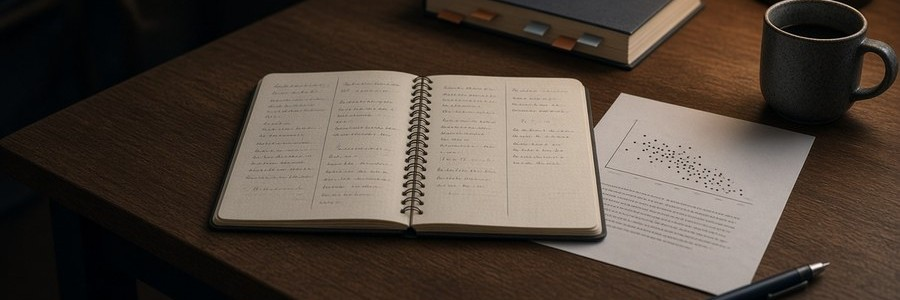
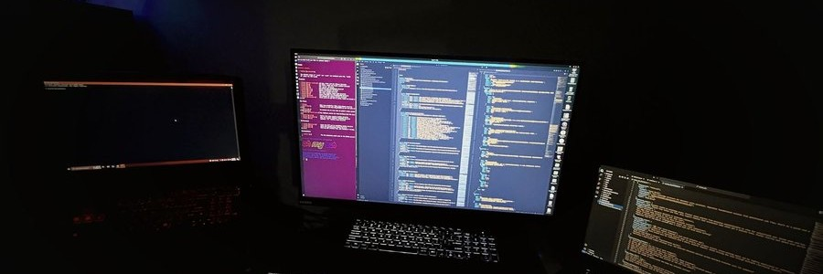
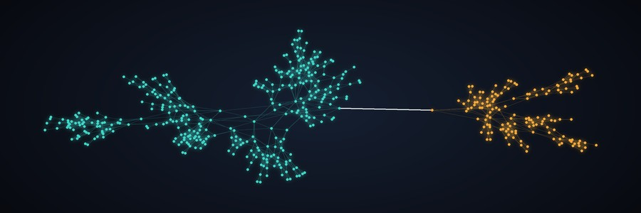
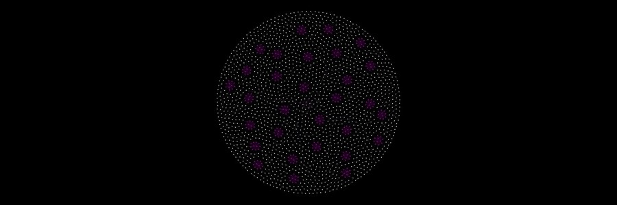

<h1 align="center">🧠 Neuresthetics</h1>

  <b>Jason Burns</b> · 📍 Portland, OR · 🌐 <a href="https://neuresthetic.net">neuresthetic.net</a>

  
  
  

> **Neuresthetics** is *kinesthetics for brains*: spelled with "eu," never "neuroesthetics." Plural, it's the practice: shaping how a mind is organized, on purpose. Singular, a **neuresthetic** is a result of that practice.

I build tools for people who work with their hands and their heads: 🛠️ field kits for restoration techs, 🗣️ a word board for kids learning to talk, and 📜 long-running research on how minds put order on the world. Neuresthetics started before AI. AI is one of the tools now, not the point.

## 🛠️ Tools

Made to be useful to other people.

<table>
  <tr>
    <td>
      
      <h3>💧 <a href="https://neuresthetics.github.io/restokit/">RestoKit</a></h3>
      A restoration kit for water, mold, and crawlspace jobs, built for any level from tech to PM and estimator. Grounded in IICRC S500 and S520, it walks a job in order and holds the rare edge cases.  
      🌐 <a href="https://neuresthetics.github.io/restokit/">page</a>
    </td>
  </tr>
</table>

<table>
  <tr>
    <td>
      
      <h3>🗣️ <a href="https://neuresthetics.github.io/anova/">ANOVA Language</a></h3>
      A free, offline AAC word board for iPad and other tablets. Buttons stay put as word levels grow. MIT licensed.  
      🌐 <a href="https://neuresthetics.github.io/anova/">page</a>
    </td>
  </tr>
</table>

<table>
  <tr>
    <td>
      
      <h3>🔎 <a href="https://neuresthetics.github.io/grokipedia/">Grokipedia Truth Audit</a></h3>
      Reproducible audits of Grokipedia articles on saved snapshots: fallacy scans and citation checks, with the data and scripts to check them. So far: 58 circumcision-related articles and the Spinoza article.  
      🌐 <a href="https://neuresthetics.github.io/grokipedia/">page</a> · 📂 <a href="https://github.com/neuresthetics/grokipedia-truth-audit">repo</a>
    </td>
  </tr>
</table>

## 🧪 Side projects

Personal projects, for curiosity.

<table>
  <tr>
    <td>
      
      <h3>🔬 <a href="https://neuresthetics.github.io/study/">Neuresthetics Genius Study</a></h3>
      A study of where remembered genius sits on a scale of lawful, non-intervening order, with a labeled belief model of how learning that order early might pay off. v8 is in progress; no results yet.  
      🌐 <a href="https://neuresthetics.github.io/study/">page</a> · 📂 <a href="https://github.com/neuresthetics/neuresthetics_genius_study">repo</a>
    </td>
  </tr>
</table>

<table>
  <tr>
    <td>
      
      <h3>📖 <a href="https://neuresthetics.github.io/book/">Freedom of Necessity</a></h3>
      A book in Spinoza's geometric manner: definitions, axioms and propositions, each standing on the ones before it. Its subject is one order of things, called God or Nature, to which the brain and its society belong.  
      🌐 <a href="https://neuresthetics.github.io/book/">page</a> · 📂 <a href="https://github.com/neuresthetics/freedom_of_necessity">repo</a>
    </td>
  </tr>
</table>

<table>
  <tr>
    <td>
      
      <h3>🧬 <a href="https://github.com/neuresthetics/split_load_sim">split_load_sim</a></h3>
      Graph-growth models that bridge the Genius Study and the book. Descended from graphtacular: one seed vertex grows by a shared strand. Results are model outputs, not findings.  
      📂 <a href="https://github.com/neuresthetics/split_load_sim">repo</a>
    </td>
  </tr>
</table>

<table>
  <tr>
    <td>
      
      <h3>🕸️ <a href="https://neuresthetics.github.io/graphtacular/">Graphtacular</a></h3>
      A C# graph engine from 2019 where each vertex grows the graph from a shared instruction list, like a genome. Rendered in Gephi. Built before AI.  
      🌐 <a href="https://neuresthetics.github.io/graphtacular/">page</a> · 📂 <a href="https://github.com/neuresthetics/graphtacular">repo</a>
    </td>
  </tr>
</table>

  

<i>Neuresthetics isn't brain art. We just use brain art anyway, because it looks cool.</i>

