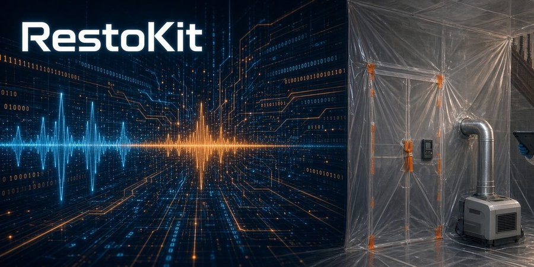
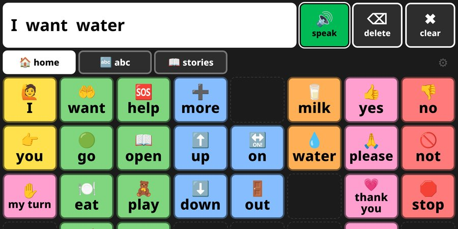
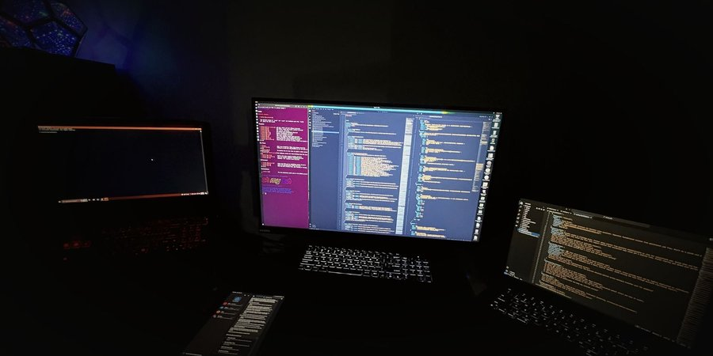
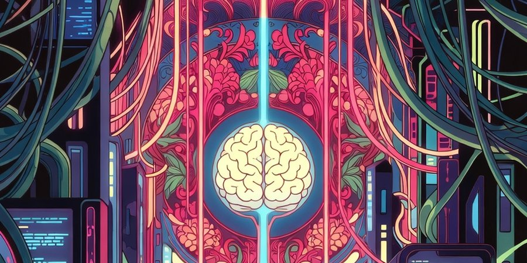
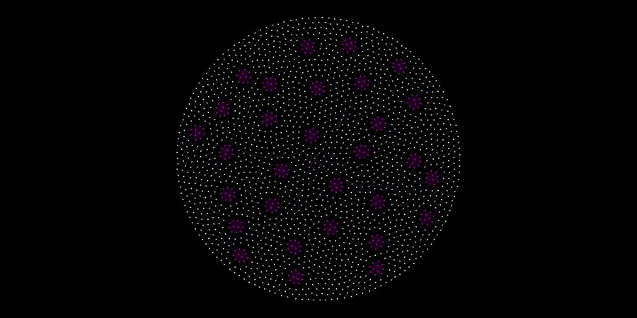

<h1 align="center">🧠 Neuresthetics</h1>

  <b>Jason Burns</b> · 📍 Portland, OR · 🌐 <a href="https://neuresthetic.net">neuresthetic.net</a>

  
  
  

> **Neuresthetics** is *kinesthetics for brains*: spelled with "eu," never "neuroesthetics." Plural, it's the practice: shaping how a mind is organized, on purpose. Singular, a **neuresthetic** is a result of that practice.

I build tools for people who work with their hands and their heads: 🛠️ field kits for restoration techs, 🗣️ a word board for kids learning to talk, and 📜 long-running research on how minds put order on the world. Neuresthetics started before AI. AI is one of the tools now, not the point.

## 🚧 Featured

<table>
  <tr>
    <td width="50%" valign="top">
      
      <h3>💧 <a href="https://neuresthetics.github.io/restokit/">RestoKit</a></h3>
        
      A restoration kit for any level, from tech to PM and estimator, grounded in IICRC S500 and S520. It holds the job flow and the rare edge cases.  
      🌐 <a href="https://neuresthetics.github.io/restokit/">page</a> · 📂 <a href="https://github.com/neuresthetics/resto_kit_public">public repo</a>
    </td>
    <td width="50%" valign="top">
      
      <h3>🗣️ <a href="https://neuresthetics.github.io/anova/">ANOVA Language</a></h3>
        
      A free, offline AAC word board for iPad and tablets. Buttons stay put while word levels grow. MIT licensed.  
      ▶️ <a href="https://neuresthetics.github.io/anova_language_dev_public/">try the app</a> · 📂 <a href="https://github.com/neuresthetics/anova_language_dev_public">repo</a>
    </td>
  </tr>
  <tr>
    <td width="50%" valign="top">
      
      <h3>📖 <a href="https://github.com/neuresthetics/freedom_of_necessity">Freedom of Necessity</a></h3>
        
      A book written axiom by axiom in the geometric style of Spinoza's Ethics. A local model checks each entry against what it cites.  
      🌐 <a href="https://neuresthetics.github.io/tech-philosophy/">page</a> · 📂 <a href="https://github.com/neuresthetics/freedom_of_necessity">repo</a>
    </td>
    <td width="50%" valign="top">
      
      <h3>🔬 <a href="https://github.com/neuresthetics/neuresthetics_genius_study">Genius Study</a></h3>
        
      The Neuresthetics study of lawful order and remembered genius, with one home for every version. Lane A describes the public record. Lane B states a belief so it can fail.  
      🌐 <a href="https://neuresthetics.github.io/tech-philosophy/">page</a> · 📂 <a href="https://github.com/neuresthetics/neuresthetics_genius_study">repo</a>
    </td>
  </tr>
  <tr>
    <td width="50%" valign="top">
      
      <h3>🔎 <a href="https://github.com/neuresthetics/grokipedia-truth-audit">Grokipedia Truth Audit</a></h3>
        
      Reproducible audits of Grokipedia articles, done on saved snapshots with the data and scripts to check them. So far: 58 circumcision-related articles and the Spinoza article.  
      📂 <a href="https://github.com/neuresthetics/grokipedia-truth-audit">repo</a>
    </td>
    <td width="50%" valign="top">
      
      <h3>🕸️ <a href="https://github.com/neuresthetics/graphtacular">Graphtacular</a></h3>
        
      A C# graph engine from 2019 where each vertex grows the graph from a shared instruction list, like a genome. Rendered in Gephi. Built before AI.  
      📂 <a href="https://github.com/neuresthetics/graphtacular">repo</a>
    </td>
  </tr>
</table>

  

<i>Neuresthetics isn't brain art. We just use brain art anyway, because the brain photographs well.</i>

