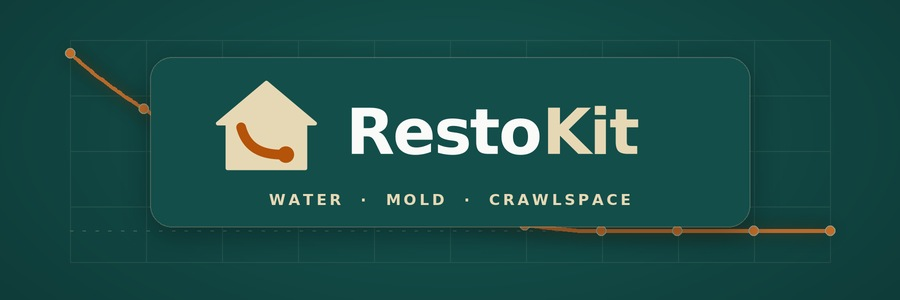
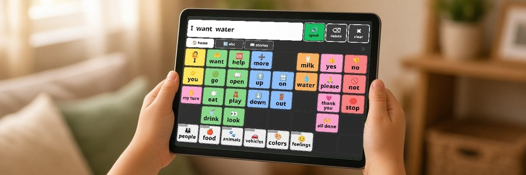
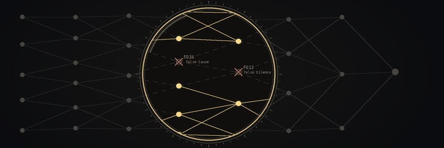
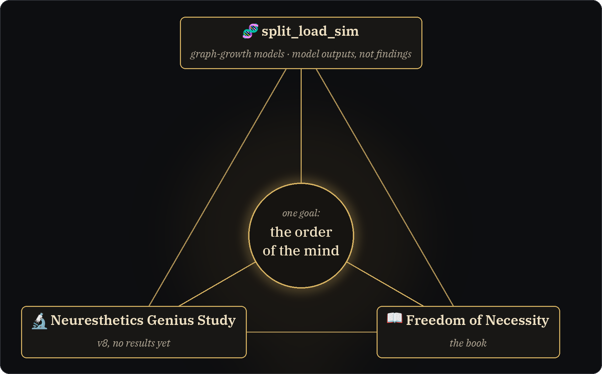
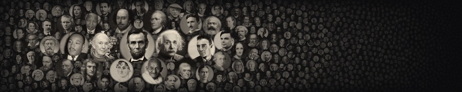
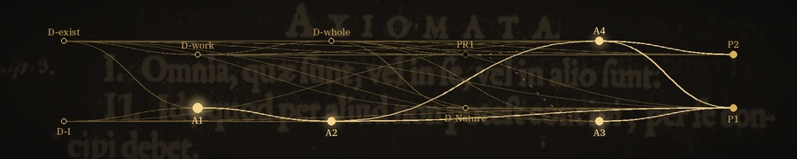

<h1 align="center">🧠 Neuresthetics</h1>

  <b>Jason Burns</b> · 📍 Portland, OR · 🌐 <a href="https://neuresthetic.net">neuresthetic.net</a>

  
  
  

> **Neuresthetics** is *kinesthetics for brains*: spelled with "eu," never "neuroesthetics." Plural, it's the practice: shaping how a mind is organized, on purpose. Singular, a **neuresthetic** is a result of that practice.

I build tools for people who work with their hands and their heads: 🛠️ field kits for restoration techs, 🗣️ a word board for kids learning to talk, and 📜 long-running research on how minds put order on the world. Neuresthetics started before AI. AI is one of the tools now, not the point.

## ⚙️ HOW IT'S BUILT

**Local models.** A Linux tower with a 20 GB GPU and 64 GB RAM runs Ollama with Qwen 27B, in a standard and an uncensored build, at 16K context. A stock 14B is being added for model-swap runs. The tower works through unattended job queues, for days if needed, for an adversarial argument harness: the models draft the strongest case for each side, code checks every cite against word-for-word source excerpts, and runs are rescored and repeated across seeds and model swaps to see how much of a result comes from the model.

**Grok.** Grok Bot (an xAI assistant) runs a set of project bots for coding, audits, writing support, and fetching the word-for-word sources those cite checks use.

## 🛠️ "REAL WORLD" PRODUCTS

Made to be useful to other people.

<table>
  <tr>
    <td></td>
  </tr>
  <tr>
    <td>
      <h3>💧 <a href="https://neuresthetics.github.io/restokit/">RestoKit</a></h3>
      A restoration kit for water, mold, and crawlspace jobs, built for any level from tech to PM and estimator. Grounded in IICRC S500 and S520, it walks a job in order and holds the rare edge cases.  
      ⚙️ <b>Runs on:</b> Commercial cloud models · loaded into the Grok app or a Grok Bot 
      🌐 <a href="https://neuresthetics.github.io/restokit/">page</a> · 📂 <a href="https://github.com/neuresthetics/resto_kit_public">repo</a>
    </td>
  </tr>
</table>

 

<table>
  <tr>
    <td></td>
  </tr>
  <tr>
    <td>
      <h3>🗣️ <a href="https://neuresthetics.github.io/anova/">ANOVA Language</a></h3>
      A free, offline AAC word board for iPad and other tablets. Buttons stay put as word levels grow. MIT licensed.  
      ⚙️ <b>Runs on:</b> No model · plain HTML, CSS and JavaScript, offline, no network calls 
      🌐 <a href="https://neuresthetics.github.io/anova/">page</a> · 📂 <a href="https://github.com/neuresthetics/anova_language_dev_public">repo</a>
    </td>
  </tr>
</table>

 

<table>
  <tr>
    <td></td>
  </tr>
  <tr>
    <td>
      <h3>🔎 <a href="https://neuresthetics.github.io/grokipedia/">Grokipedia Truth Audit</a></h3>
      Reproducible audits of Grokipedia articles on saved snapshots: fallacy scans and citation checks, with the data and scripts to check them. So far: 58 circumcision-related articles and the Spinoza article.  
      ⚙️ <b>Runs on:</b> Grok · a model reads saved snapshots against the substance_lens fallacy catalogue; scripts verify quotes and citations 
      🌐 <a href="https://neuresthetics.github.io/grokipedia/">page</a> · 📂 <a href="https://github.com/neuresthetics/grokipedia-truth-audit">repo</a>
    </td>
  </tr>
</table>

 

<table>
  <tr>
    <td></td>
  </tr>
  <tr>
    <td>
      <h3>🔍 <a href="https://neuresthetics.github.io/substance-lens/">substance_lens</a></h3>
      A JSON prompt spec: paste it into a chat model, give it a claim, and it checks the argument step by step and scans both the claim and its strongest counter-case for 67 fallacies. Flags are judgments to verify, not proofs.  
      ⚙️ <b>Runs on:</b> Any capable chat model · a prompt spec, built with Grok in mind; no code ships 
      🌐 <a href="https://neuresthetics.github.io/substance-lens/">page</a> · 📂 <a href="https://github.com/neuresthetics/substance_lens">repo</a>
    </td>
  </tr>
</table>

 

## 🧠 BRAND PROJECT

The Neuresthetics project itself: one inquiry, in three parts.

The study, the book and split_load_sim are the three sides of the Neuresthetics project. The Genius Study (v8) collects sourced records of remembered geniuses and states a labeled belief model about how early lawful form might pay off; the book builds, axiom by axiom, the one order (God or Nature) to which the brain and its society belong. split_load_sim is how we go between them. None of the three comes first; each draws on the other two, circling one goal. split_load_sim grows graphs as models of how a mind's maps could be structured, drawing on the book's axioms and testing whether the study's Lane B assumptions produce the effect they claim inside the model. Its results are model outputs, not findings, and the study has no results yet. The book in turn tries to key in on what makes v8 go around, and findings in any one can send the others back to work.

  

<table>
  <tr>
    <td></td>
  </tr>
  <tr>
    <td>
      <b>🔬 <a href="https://neuresthetics.github.io/study/">Neuresthetics Genius Study</a></b> 
      <b>The study.</b> Where remembered genius sits on a scale of lawful, non-intervening order, with a labeled belief model. v8 is in progress; no results yet. 
      ⚙️ <b>Runs on:</b> Grok · Grok Bot agents draft person records from web search and the cited pages (unreviewed) 
      🌐 <a href="https://neuresthetics.github.io/study/">page</a> · 📂 <a href="https://github.com/neuresthetics/neuresthetics_genius_study">repo</a> · 🖼️ <a href="img/study-faces-credits.md">portrait credits</a>
    </td>
  </tr>
  <tr>
    <td></td>
  </tr>
  <tr>
    <td>
      <b>📖 <a href="https://neuresthetics.github.io/book/">Freedom of Necessity</a></b> 
      <b>The book.</b> A Spinoza-style geometric book on one order, God or Nature, to which the brain and its society belong. 
      ⚙️ <b>Runs on:</b> Local Qwen 27B · checks each entry against what it cites; argument harness in progress 
      🌐 <a href="https://neuresthetics.github.io/book/">page</a> · 📂 <a href="https://github.com/neuresthetics/freedom_of_necessity">repo</a> · 🖼️ <a href="img/book-credits.md">image credit</a>
    </td>
  </tr>
  <tr>
    <td></td>
  </tr>
  <tr>
    <td>
      <b>🧬 <a href="https://neuresthetics.github.io/split-load-sim/">split_load_sim</a></b> 
      <b>The bridge.</b> Graph-growth models that connect the study and the book, descended from <a href="https://github.com/neuresthetics/graphtacular">graphtacular</a> (2019). Model outputs, not findings. 
      ⚙️ <b>Runs on:</b> No model · seeded Python graph models 
      🌐 <a href="https://neuresthetics.github.io/split-load-sim/">page</a> · 📂 <a href="https://github.com/neuresthetics/split_load_sim">repo</a>
    </td>
  </tr>
</table>
