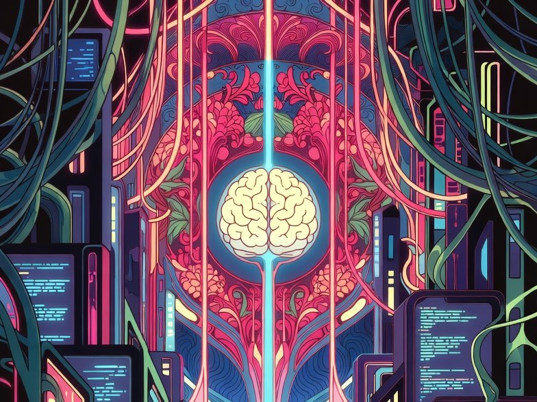

  

<h1 align="center">🧠 Neuresthetics</h1>

  <b>Jason Burns</b> · 📍 Portland, OR · 🌐 <a href="https://neuresthetic.net">neuresthetic.net</a>

  
  
  

> **Neuresthetics** is *kinesthetics for brains*: spelled with "eu," never "neuroesthetics." Plural, it's the practice: shaping how a mind is organized, on purpose. Singular, a **neuresthetic** is a result of that practice.

I build tools for people who work with their hands and their heads: 🛠️ field kits for restoration techs, 🗣️ a word board for kids learning to talk, and 📜 long-running research on how minds put order on the world. Neuresthetics started before AI. AI is one of the tools now, not the point.

## 🚧 Projects

<table>
  <tr>
    <td width="50%" valign="top">
      
      <h3>💧 <a href="https://neuresthetics.github.io/restokit/">RestoKit</a></h3>
        
      A voice-ready field kit for water, mold, and crawlspace restoration, grounded in IICRC S500 and S520. It holds the job flow and the rare edge cases so a tech doesn't have to.  
      🔒 Full kit is private · <a href="https://github.com/neuresthetics/resto_kit_public">public repo</a>
    </td>
    <td width="50%" valign="top">
      
      <h3>🗣️ <a href="https://neuresthetics.github.io/anova/">ANOVA Language</a></h3>
         
      A free AAC word board for iPad and tablets. Buttons stay put, word levels grow, and it works offline. Plain HTML, CSS, and JavaScript.  
      ▶️ <a href="https://neuresthetics.github.io/anova_language_dev_public/">Try the app</a> · <a href="https://github.com/neuresthetics/anova_language_dev_public">repo</a>
    </td>
  </tr>
  <tr>
    <td width="50%" valign="top">
      
      <h3>📖 <a href="https://github.com/neuresthetics/freedom_of_necessity">Freedom of Necessity</a></h3>
        
      A book written axiom by axiom, in the geometric style of Spinoza's Ethics, with a harness where a local model checks each entry against what it cites.
    </td>
    <td width="50%" valign="top">
      
      <h3>🔬 <a href="https://github.com/neuresthetics/neuresthetics_v7">V7 study</a></h3>
        
      The seventh version of the Neuresthetics study. Lane A describes what the public record shows. Lane B states a belief out loud and writes it so it can fail. Lane A doesn't depend on Lane B.
    </td>
  </tr>
</table>

## 🧰 Smaller tools

<table>
  <tr>
    <td width="25%" valign="top" align="center">
       
      <b>⚙️ <a href="https://github.com/neuresthetics/steel_man_s.e">steel_man_s.e</a></b> 
      Rebuilds an argument into its strongest form, in stages.
    </td>
    <td width="25%" valign="top" align="center">
       
      <b>🌱 <a href="https://github.com/neuresthetics/seed">seed</a></b> 
      A small JSON kernel that builds a reasoning framework for any topic.
    </td>
    <td width="25%" valign="top" align="center">
       
      <b>🌸 <a href="https://github.com/neuresthetics/graphtacular">graphtacular</a></b> 
      A C# graph engine where each vertex runs its own instructions. Built before AI.
    </td>
    <td width="25%" valign="top" align="center">
      <h1>🔍</h1>
      <b><a href="https://github.com/neuresthetics/substance_lens">substance_lens</a></b> 
      A JSON framework for AI chats. Every claim is unproven until it passes the logic-gate checks.
    </td>
  </tr>
</table>

## 🪖 Background

Army veteran with a background in carpentry and restoration.

  

