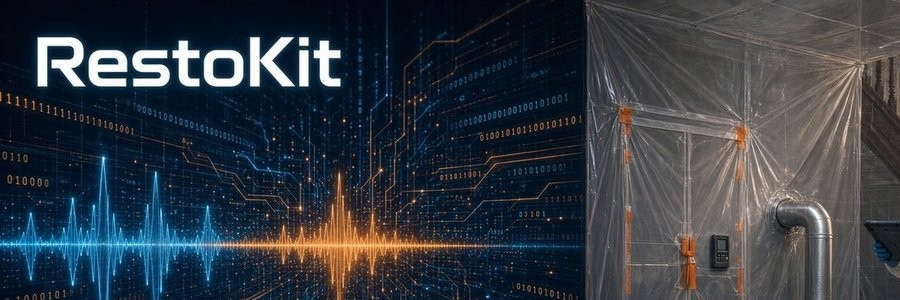
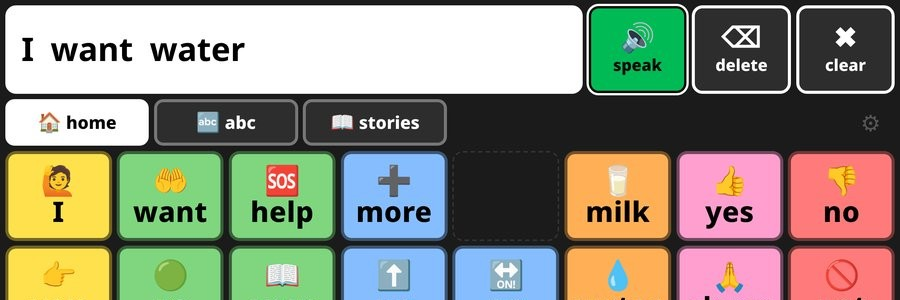
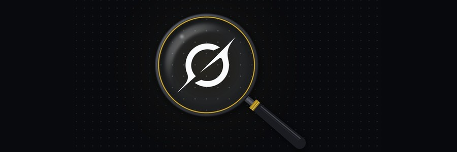
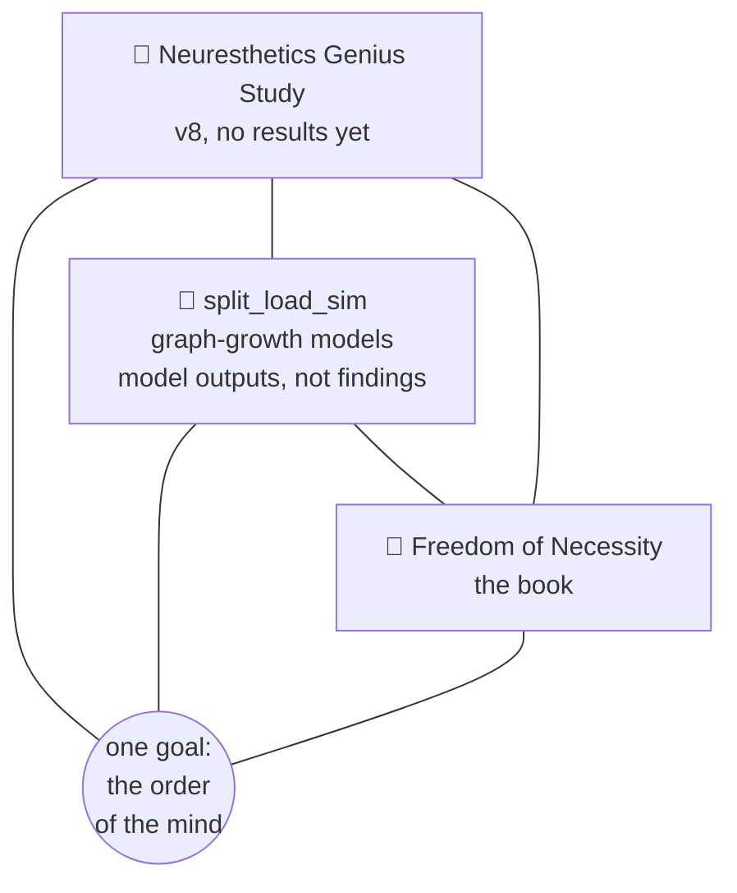
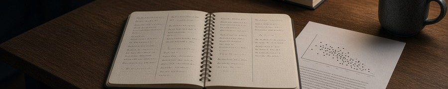
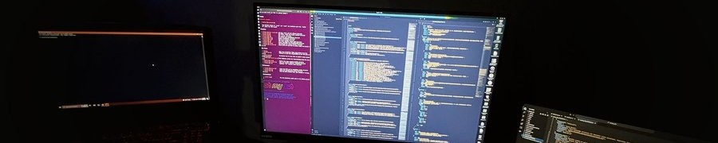
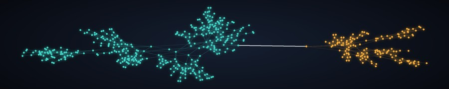
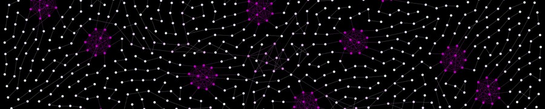

<h1 align="center">🧠 Neuresthetics</h1>

  <b>Jason Burns</b> · 📍 Portland, OR · 🌐 <a href="https://neuresthetic.net">neuresthetic.net</a>

  
  
  

> **Neuresthetics** is *kinesthetics for brains*: spelled with "eu," never "neuroesthetics." Plural, it's the practice: shaping how a mind is organized, on purpose. Singular, a **neuresthetic** is a result of that practice.

I build tools for people who work with their hands and their heads: 🛠️ field kits for restoration techs, 🗣️ a word board for kids learning to talk, and 📜 long-running research on how minds put order on the world. Neuresthetics started before AI. AI is one of the tools now, not the point.

## 🛠️ Tools

Made to be useful to other people.

<table>
  <tr>
    <td></td>
  </tr>
  <tr>
    <td>
      <h3>💧 <a href="https://neuresthetics.github.io/restokit/">RestoKit</a></h3>
      A restoration kit for water, mold, and crawlspace jobs, built for any level from tech to PM and estimator. Grounded in IICRC S500 and S520, it walks a job in order and holds the rare edge cases.  
      🌐 <a href="https://neuresthetics.github.io/restokit/">page</a> · 📂 <a href="https://github.com/neuresthetics/resto_kit_public">repo</a>
    </td>
  </tr>
</table>

 

<table>
  <tr>
    <td></td>
  </tr>
  <tr>
    <td>
      <h3>🗣️ <a href="https://neuresthetics.github.io/anova/">ANOVA Language</a></h3>
      A free, offline AAC word board for iPad and other tablets. Buttons stay put as word levels grow. MIT licensed.  
      🌐 <a href="https://neuresthetics.github.io/anova/">page</a> · 📂 <a href="https://github.com/neuresthetics/anova_language_dev_public">repo</a>
    </td>
  </tr>
</table>

 

<table>
  <tr>
    <td></td>
  </tr>
  <tr>
    <td>
      <h3>🔎 <a href="https://neuresthetics.github.io/grokipedia/">Grokipedia Truth Audit</a></h3>
      Reproducible audits of Grokipedia articles on saved snapshots: fallacy scans and citation checks, with the data and scripts to check them. So far: 58 circumcision-related articles and the Spinoza article.  
      🌐 <a href="https://neuresthetics.github.io/grokipedia/">page</a> · 📂 <a href="https://github.com/neuresthetics/grokipedia-truth-audit">repo</a>
    </td>
  </tr>
</table>

 

## 🧪 Side projects

Personal side projects, for curiosity.

The study, the book and split_load_sim sit side by side as parts of one larger project. The Genius Study (v8) collects sourced records of remembered geniuses and states a labeled belief model about how early lawful form might pay off; the book builds, axiom by axiom, the one order (God or Nature) to which the brain and its society belong. split_load_sim is how we go between them. None of the three comes first; each draws on the other two, circling one goal: it grows graphs as models of how a mind's maps could be structured, drawing on the book's axioms and testing whether the study's Lane B assumptions produce the effect they claim inside the model. Its results are model outputs, not findings, and the study has no results yet. The book in turn tries to key in on what makes v8 go around, and findings in any one can send the others back to work. Graphtacular is the 2019 relic where split_load_sim's strand idea started.

<table>
  <tr>
    <td></td>
  </tr>
  <tr>
    <td>
      <b>🔬 <a href="https://neuresthetics.github.io/study/">Neuresthetics Genius Study</a></b> 
      <b>The study.</b> Where remembered genius sits on a scale of lawful, non-intervening order, with a labeled belief model. v8 is in progress; no results yet. 
      🌐 <a href="https://neuresthetics.github.io/study/">page</a> · 📂 <a href="https://github.com/neuresthetics/neuresthetics_genius_study">repo</a>
    </td>
  </tr>
  <tr>
    <td></td>
  </tr>
  <tr>
    <td>
      <b>📖 <a href="https://neuresthetics.github.io/book/">Freedom of Necessity</a></b> 
      <b>The book.</b> A Spinoza-style geometric book on one order, God or Nature, to which the brain and its society belong. 
      🌐 <a href="https://neuresthetics.github.io/book/">page</a> · 📂 <a href="https://github.com/neuresthetics/freedom_of_necessity">repo</a>
    </td>
  </tr>
  <tr>
    <td></td>
  </tr>
  <tr>
    <td>
      <b>🧬 <a href="https://github.com/neuresthetics/split_load_sim">split_load_sim</a></b> 
      <b>The bridge.</b> Graph-growth models that connect the study and the book, descended from graphtacular. Model outputs, not findings. 
      📂 <a href="https://github.com/neuresthetics/split_load_sim">repo</a>
    </td>
  </tr>
  <tr>
    <td></td>
  </tr>
  <tr>
    <td>
      <b>🕸️ <a href="https://neuresthetics.github.io/graphtacular/">Graphtacular</a></b> 
      <b>The ancestor (2019).</b> A C# graph engine where each vertex grows the graph from a shared instruction list (a strand), like a genome. Built before AI. 
      🌐 <a href="https://neuresthetics.github.io/graphtacular/">page</a> · 📂 <a href="https://github.com/neuresthetics/graphtacular">repo</a>
    </td>
  </tr>
</table>
