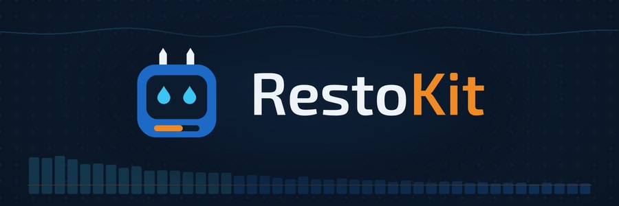

<h1 align="center">🧠 Neuresthetics</h1>

  <b>Jason Burns</b> · 🌐 <a href="https://neuresthetic.net">neuresthetic.net</a>

  
  
  

> **Neuresthetics** is *kinesthetics for brains*: spelled with "eu," never "neuroesthetics." Plural, it's the practice: shaping how a mind is organized, on purpose. Singular, a **neuresthetic** is a result of that practice.

I build tools for people who work with their hands and their heads: 🛠️ field kits for restoration techs, 🗣️ a word board for kids learning to talk, and 📜 long-running research on how minds put order on the world. Neuresthetics started before AI. AI is one of the tools now, not the point.

## ABOUT ME

Restoration tech. Water, mold, and crawlspace, across a few companies. RestoKit is the kit I wanted on those jobs.

I am building a speech pad for my daughter. ANOVA Language. The buttons stay put as her word levels grow. It runs offline, on a tablet.

The long work is the study and the book. Sourced records, a labeled belief model, and a geometric construction of one order, God or Nature. No results to announce.

The name on the work is Neuresthetics, since 2017.

## 🛠️ "REAL WORLD" PRODUCTS

Made to be useful to other people.

<table>
  <tr>
    <td></td>
  </tr>
  <tr>
    <td>
      <h3>💧 <a href="https://neuresthetics.github.io/restokit/">RestoKit</a></h3>
      A restoration kit for water, mold, and crawlspace jobs, built for any level from tech to PM and estimator. Grounded in IICRC S500 and S520, it walks a job in order and holds the rare edge cases.  
      ⚙️ <b>Runs on:</b> Commercial cloud models · loaded into the Grok app or a Grok Bot 
      🌐 <a href="https://neuresthetics.github.io/restokit/">page</a> · 📂 <a href="https://github.com/neuresthetics/resto_kit_public">repo</a>
    </td>
  </tr>
</table>

 

<table>
  <tr>
    <td></td>
  </tr>
  <tr>
    <td>
      <h3>🗣️ <a href="https://neuresthetics.github.io/anova/">ANOVA Language</a></h3>
      A free, offline AAC word board for iPad and other tablets. Buttons stay put as word levels grow. MIT licensed.  
      ⚙️ <b>Runs on:</b> No model · plain HTML, CSS and JavaScript, offline, no network calls 
      🌐 <a href="https://neuresthetics.github.io/anova/">page</a> · 📂 <a href="https://github.com/neuresthetics/anova_language_dev_public">repo</a>
    </td>
  </tr>
</table>

 

<table>
  <tr>
    <td></td>
  </tr>
  <tr>
    <td>
      <h3>🔎 Grokipedia Truth Audit</h3>
      Audits of Grokipedia articles on saved snapshots, with the data and scripts to check them. Fallacy scans and citation checks so far cover 58 circumcision-related articles and the Spinoza article.  
      ⚙️ <b>Runs on:</b> Grok · a model reads saved snapshots against a fallacy catalogue; scripts verify quotes and citations 
      🌐 page · 📂 repo
    </td>
  </tr>
</table>

 

## 🧠 BRAND PROJECT

The Neuresthetics project itself: the study and the book.

The Genius Study (v8) collects sourced records of remembered geniuses and states a labeled belief model about how early lawful form might pay off. The book builds, axiom by axiom, the one order (God or Nature) to which the brain and its society belong. The study has no results yet. The book tries to key in on what makes v8 go around, and findings in either can send the other back to work.

<table>
  <tr>
    <td></td>
  </tr>
  <tr>
    <td>
      <b>🔬 <a href="https://neuresthetics.github.io/study/">Neuresthetics Genius Study</a></b> 
      <b>The study.</b> Where remembered genius sits on a scale of lawful, non-intervening order, with a labeled belief model. v8 is in progress; no results yet. 
      ⚙️ <b>Runs on:</b> Grok · Grok Bot agents draft person records from web search and the cited pages (unreviewed) 
      🌐 <a href="https://neuresthetics.github.io/study/">page</a> · 📂 <a href="https://github.com/neuresthetics/neuresthetics_genius_study">repo</a> · 🖼️ <a href="img/study-faces-credits.md">portrait credits</a>
    </td>
  </tr>
  <tr>
    <td></td>
  </tr>
  <tr>
    <td>
      <b>📖 <a href="https://neuresthetics.github.io/book/">Freedom of Necessity</a></b> 
      <b>The book.</b> A Spinoza-style geometric book on one order, God or Nature, to which the brain and its society belong. 
      ⚙️ <b>Runs on:</b> Local Qwen 27B · checks each entry against what it cites; argument harness in progress 
      🌐 <a href="https://neuresthetics.github.io/book/">page</a> · 📂 <a href="https://github.com/neuresthetics/freedom_of_necessity">repo</a> · 🖼️ <a href="img/book-credits.md">image credit</a>
    </td>
  </tr>
</table>
